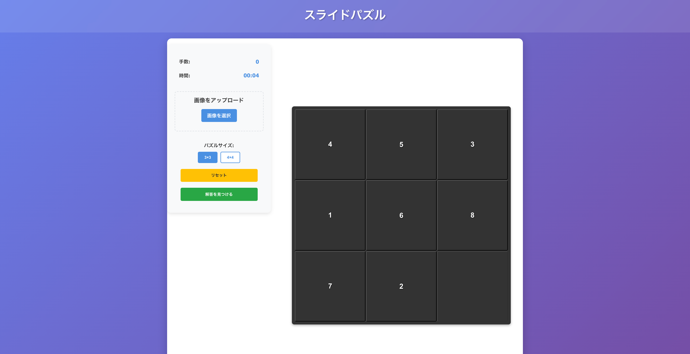

# スライドパズル

React + TypeScript + Viteで作成されたスライドパズルゲームです．



## 機能

- **3×3，4×4のパズルサイズ**：サイズを選択してゲームを開始できます
- **画像アップロード**：自分の画像をアップロードしてパズルを作成できます
- **確実に解ける配置**：正解配置からランダムに移動を適用することで，必ず解ける配置を生成します
- **解答表示**：解けない場合には正解配置までの手順を計算+アニメーションで表示する機能があります
- **ゲーム情報表示**：移動回数と経過時間を表示します
- **レスポンシブデザイン**：様々な画面サイズに対応しています

## 技術スタック

- **React 19**：UIライブラリ
- **TypeScript**：型安全性
- **Vite**：高速な開発環境とビルドツール
- **CSS**：Flexbox，Grid，レスポンシブデザイン

## セットアップ

### 必要な環境

- Node.js 18.0.0以上
- npm または yarn

### インストール

```bash
# リポジトリをクローン
git clone https://github.com/Hiromu-USHIHARA/slide-puzzle.git
cd slide-puzzle

# 依存関係をインストール
npm install

# 開発サーバーを起動
npm run dev
```

### ビルド

```bash
# 本番用ビルド
npm run build

# ビルド結果をプレビュー
npm run preview
```

## ゲームの遊び方

1. **パズルサイズを選択**：3×3または4×4を選択します
2. **画像をアップロード**（オプション）：自分の画像をアップロードしてパズルを作成できます
3. **タイルをクリック**：空きマスに隣接するタイルをクリックして移動します
4. **完成を目指す**：すべてのタイルを正しい位置に並べ替えて完成させます
5. **リセット**：新しいゲームを開始するにはリセットボタンをクリックします


## プロジェクト構造

```
src/
├── components/
│   ├── GameControls.tsx    # ゲームコントロール
│   ├── GameInfo.tsx        # ゲーム情報表示
│   ├── ImageUpload.tsx     # 画像アップロード
│   ├── PuzzleBoard.tsx     # パズルボード
│   ├── useImageUpload.ts   # 画像アップロードフック
│   └── useSlidePuzzle.ts   # パズルロジックフック
├── App.tsx                 # メインアプリケーション
└── main.tsx               # エントリーポイント
```

## 開発

### コード品質

- **Biome**：リンターとフォーマッター
- **TypeScript**：型チェック
- **ESLint**：コード品質チェック

### コマンド

```bash
# コードチェック
npm run lint

# コードフォーマット
npm run format

# 型チェック
npm run type-check
```

## ライセンス

MIT License

## 作者

**Hiromu Ushihara**

- GitHub: [@Hiromu-USHIHARA](https://github.com/Hiromu-USHIHARA)
- プロジェクト: [slide-puzzle](https://github.com/Hiromu-USHIHARA/slide-puzzle)

## 貢献

プルリクエストやイシューの報告を歓迎します．

## 更新履歴

- **v1.0.0**：初期リリース
  - 3×3，4×4パズル対応
  - 画像アップロード機能
  - 確実に解けるシャッフルアルゴリズム
  - レスポンシブデザイン

> This README was automatically generated by an LLM based on analyzing the code implementation.
